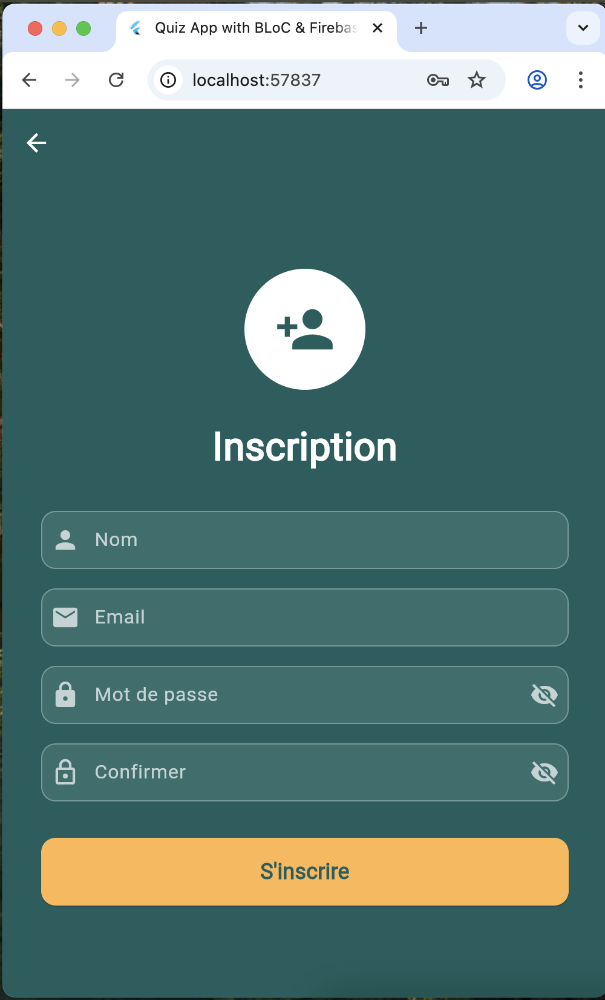
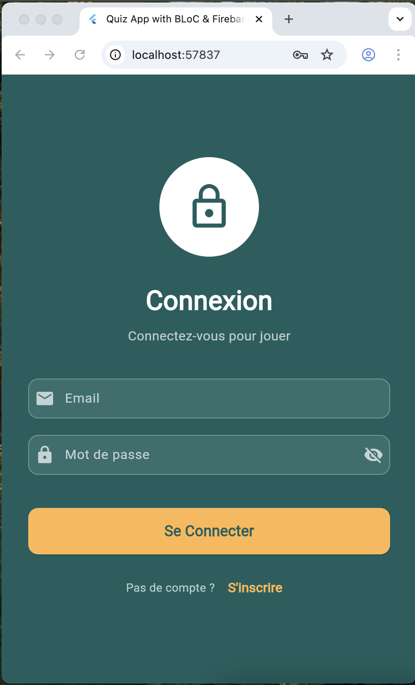
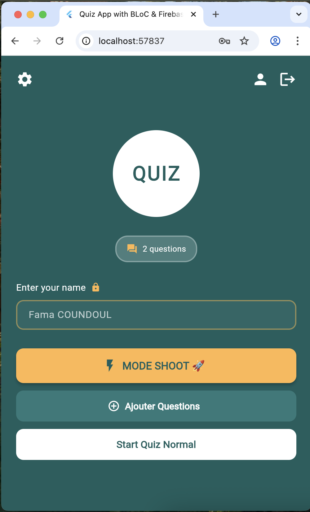
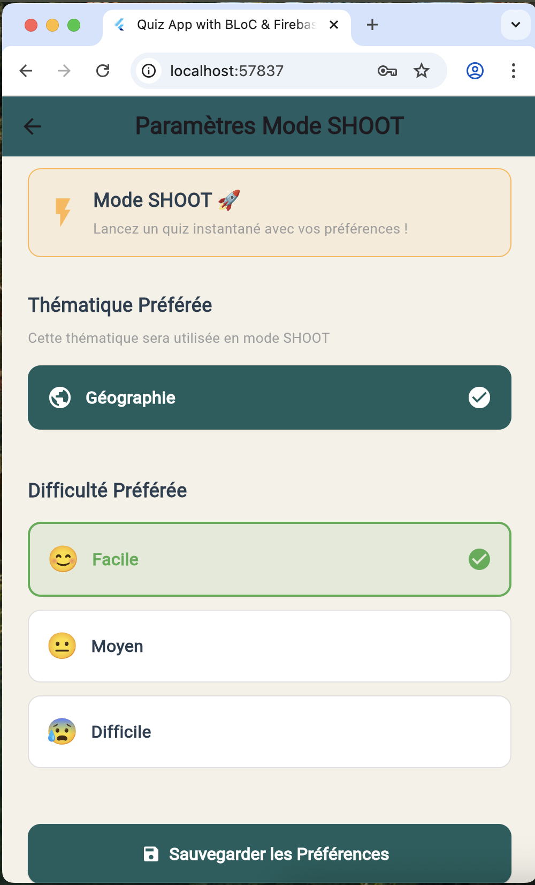
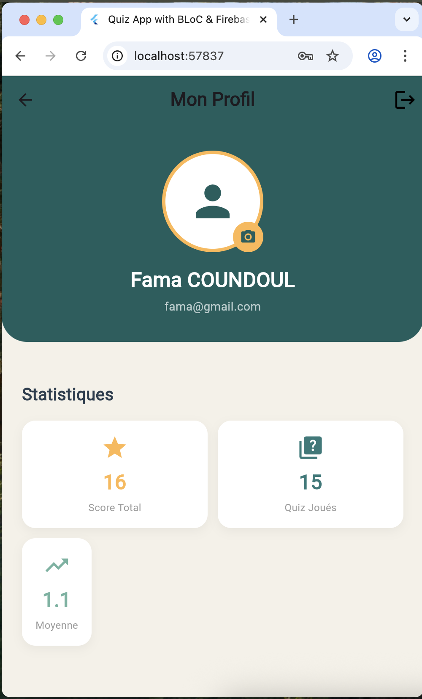
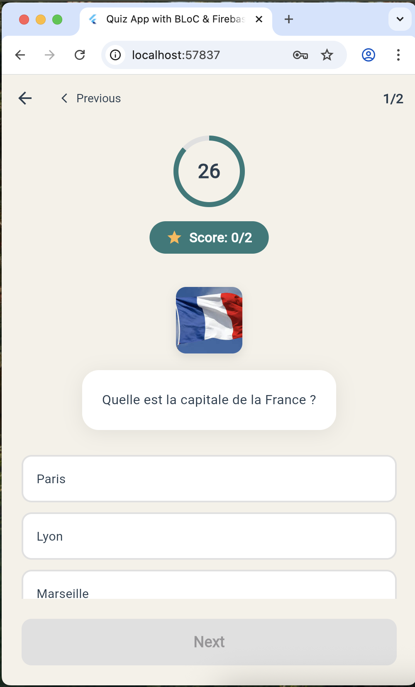

# 🎯 Quiz App - Flutter & Firebase

> Application de Quiz interactive avec authentification, stockage cloud et analytics

<div style="display: flex; gap: 20px;">
  
  
  
</div>

<div style="display: flex; gap: 20px;">
  
  
  
</div>


---

## 📋 Table des Matières

- [À Propos](#à-propos)
- [Fonctionnalités](#fonctionnalités)
- [Architecture](#architecture)
- [Technologies](#technologies)
- [Installation](#installation)
- [Configuration Firebase](#configuration-firebase)
- [Structure du Projet](#structure-du-projet)
- [Utilisation](#utilisation)
- [Firebase Console](#firebase-console)
- [Auteur](#auteur)

---

## 🎯 À Propos

Application de quiz développée avec **Flutter** et **Firebase** dans le cadre du **TP3 - HAI912I**. L'application permet aux utilisateurs de :

- S'authentifier (inscription/connexion)
- Jouer à des quiz sur différentes thématiques et de choisir le niveau
- Ajouter leurs propres questions
- Suivre leurs statistiques personnelles
- Utiliser le mode **SHOOT** pour des quiz rapides

---

## ✨ Fonctionnalités

### 🔐 Authentification (Question 2)
- **Inscription** avec email/password
- **Connexion** sécurisée via Firebase Authentication
- **Gestion de session** persistante
- **Profil utilisateur** avec avatar personnalisé

### 📊 Gestion des Questions (Question 1)
- **Stockage Firestore** des questions/réponses
- **Import automatique** depuis JSON vers Firestore
- **Ajout dynamique** de nouvelles questions
- **Filtrage** par thématique et difficulté
- **Temps réel** : synchronisation instantanée

### 🎮 Système de Quiz (BLoC Pattern)
- **Timer** de 30 secondes par question
- **Score en temps réel**
- **Feedback visuel** (vert/rouge)
- **Progression** question par question
- **Sauvegarde automatique** des scores

### 🖼️ Stockage d'Images (Question 3)
- **Upload d'avatars** vers Firebase Storage
- **Compatibilité Web & Mobile** (XFile)
- **Compression automatique** (512x512px, 75% qualité)
- **URLs sécurisées** avec Firebase

### 📈 Analytics (Question 4)
- **Événements loggés** :
  - `sign_up`, `login` : Authentification
  - `quiz_start`, `quiz_complete` : Scores et statistiques
  - `shoot_mode_activated` : Mode rapide
  - `avatar_upload`, `question_added` : Actions utilisateur
  
- **User Properties** :
  - `preferred_theme` : Thématique préférée
  - `preferred_difficulty` : Difficulté préférée
  - `user_level` : Niveau (beginner/intermediate/expert)

### 🚀 Mode SHOOT (Question 4.3)
- **Lancement rapide** sans configuration
- **Préférences sauvegardées** (thème + difficulté)
- **10 questions** filtrées automatiquement
- **Analytics intégré** pour tracking

---

## 🏗️ Architecture

Le projet suit une **architecture en couches** (Clean Architecture) :

```
lib/
├── business_logic/          # Logique métier (BLoC)
│   └── bloc/
│       ├── quiz_bloc.dart
│       ├── quiz_event.dart
│       └── quiz_state.dart
│
├── data/                    # Données et sources
│   ├── models/
│   │   ├── question_model.dart
│   │   └── user_model.dart
│   └── repositories/
│       ├── analytics_repository.dart
│       ├── auth_repository.dart
│       ├── firestore_repository.dart
│       ├── question_repository.dart
│       └── storage_repository.dart
│
└── presentation/            # Interface utilisateur
    ├── constants/
    │   └── app_colors.dart
    └── pages/
        ├── add_question_page.dart
        ├── login_page.dart
        ├── profile_page.dart
        ├── quizz_page.dart
        ├── register_page.dart
        ├── settings_page.dart
        └── welcome_page_realtime.dart
```

### Patterns Utilisés

- **BLoC (Business Logic Component)** : Gestion d'état réactive
- **Repository Pattern** : Abstraction des sources de données
- **Singleton** : Instances uniques des services Firebase
- **Factory Pattern** : Construction des modèles depuis JSON/Firestore

---

## 🛠️ Technologies

### Frontend
- **Flutter 3.x** : Framework UI multiplateforme
- **Dart** : Langage de programmation
- **flutter_bloc** : Gestion d'état
- **equatable** : Comparaison d'objets

### Backend & Services
- **Firebase Core** : Initialisation Firebase
- **Firebase Auth** : Authentification utilisateurs
- **Cloud Firestore** : Base de données NoSQL
- **Firebase Storage** : Stockage de fichiers
- **Firebase Analytics** : Suivi du comportement

### Autres
- **image_picker** : Sélection d'images (Web & Mobile)
- **shared_preferences** : Stockage local des préférences

---

## 📦 Installation

### Prérequis

- **Flutter SDK** >= 3.0.0
- **Dart SDK** >= 2.19.0
- **Firebase CLI** (pour configuration)
- **Android Studio** / **VS Code** / **IntelliJ IDEA**

### Étapes

1. **Cloner le repository**
```bash
git clone https://github.com/FamaCoundoul/hai912i_tp2_quizz_bloc_firestore.git
cd hai912i_tp2_quizz_bloc_firestore
```

2. **Installer les dépendances**
```bash
flutter pub get
```

3. **Configurer Firebase** (voir section suivante)

4. **Lancer l'application**
```bash
# Web
flutter run -d chrome

# Android
flutter run -d <device_id>

# iOS (macOS uniquement)
flutter run -d <device_id>
```

---

## 🔥 Configuration Firebase

### 1. Créer un Projet Firebase

1. Accédez à [Firebase Console](https://console.firebase.google.com/)
2. Cliquez sur **"Ajouter un projet"**
3. Nommez votre projet : `quiz-app-firebase`
4. Activez Google Analytics (recommandé)
5. Cliquez sur **"Créer le projet"**

### 2. Activer les Services

#### Firestore Database
```
Firebase Console → Firestore Database → Créer une base de données
→ Mode production → Région : europe-west1
```

**Rules** (`firestore.rules`) :
```javascript
rules_version = '2';
service cloud.firestore {
  match /databases/{database}/documents {
    match /users/{userId} {
      allow read: if true;
      allow create: if request.auth != null;
      allow update, delete: if request.auth.uid == userId;
    }
    match /questions/{questionId} {
      allow read: if true;
      allow write: if request.auth != null;
    }
  }
}
```

#### Firebase Storage
```
Firebase Console → Storage → Commencer
→ Mode test → Région : europe-west1
```

**Rules** (`storage.rules`) :
```javascript
rules_version = '2';
service firebase.storage {
  match /b/{bucket}/o {
    match /avatars/{fileName} {
      allow read: if true;
      allow write: if request.auth != null;
    }
  }
}
```

#### Authentication
```
Firebase Console → Authentication → Commencer
→ E-mail/Mot de passe → Activer
```

#### Analytics
```
Firebase Console → Analytics → Activer
```

---

## 📁 Structure du Projet

```
quiz_app_firebase/
│
├── assets/
│   ├── data/
│   │   └── quizz_questions.json
│   └── images/
│       └── placeholder.png
        ├── image_quizz.png
│
├── lib/
│   ├── business_logic/bloc/
│   │   ├── quiz_bloc.dart
│   │   ├── quiz_event.dart
│   │   └── quiz_state.dart
│   │
│   ├── data/
│   │   ├── models/
│   │   │   ├── question_model.dart
│   │   │   └── user_model.dart
│   │   └── repositories/
│   │       ├── analytics_repository.dart
│   │       ├── auth_repository.dart
│   │       ├── firestore_repository.dart
│   │       ├── question_repository.dart
│   │       └── storage_repository.dart
│   │
│   ├── presentation/
│   │   ├── constants/app_colors.dart
│   │   └── pages/
│   │       ├── add_question_page.dart
│   │       ├── login_page.dart
│   │       ├── profile_page.dart
│   │       ├── quizz_page.dart
│   │       ├── register_page.dart
│   │       ├── settings_page.dart
│   │       └── welcome_page_realtime.dart
│   │
│   ├── firebase_options.dart
│   └── main.dart
│
└── pubspec.yaml
```

---

## 🎮 Utilisation

### Première Utilisation

1. **Lancez l'application**
2. **Cliquez sur "S'inscrire"**
3. Entrez vos informations
4. **Validez** → Compte créé ✅

### Mode SHOOT 🚀

1. **⚙️ Paramètres**
2. Choisissez thématique + difficulté
3. **"Sauvegarder"**
4. **"MODE SHOOT 🚀"**
5. Quiz lancé instantanément ! ⚡

---

## 📊 Firebase Console

### Firestore Database
```
users/{uid}/
  ├── displayName: "Fama COUNDOUL"
  ├── totalScore: 15
  └── quizzesPlayed: 2

questions/{id}/
  ├── questionText: "..."
  ├── options: [...]
  └── theme: "Géographie"
```

### Analytics Events
```
- sign_up, login
- quiz_start, quiz_complete
- shoot_mode_activated
```

### User Properties
```
- preferred_theme: "Géographie"
- preferred_difficulty: "2"
- user_level: "intermediate"
```

---

## 👥 Auteur

**Fama COUNDOUL**  
HAI912I - Université de Montpellier  
TP3 - Flutter & Firebase

---

**🎯 Bon Quiz ! 🚀**
